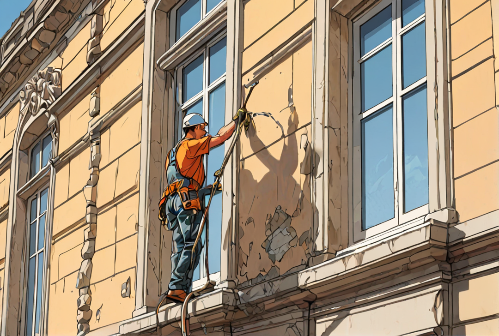

# Steinreinigung in Wien und Niederösterreich: Ihr Experte ENS

Willkommen bei ENS, Ihrem Spezialisten für professionelle Steinreinigung in Wien und Niederösterreich. Unsere langjährige Erfahrung und unser Engagement für höchste Qualitätsstandards machen uns zu Ihrem idealen Partner, wenn es um die Pflege und Aufwertung Ihrer Steinflächen geht. Egal ob Terrasse, Fassade oder Innenbereich – wir bringen den ursprünglichen Glanz Ihrer Steinflächen zurück.

## Unsere Steinreinigungsdienste

Bei ENS bieten wir eine breite Palette an Steinreinigungsdiensten, die speziell auf Ihre Bedürfnisse und den jeweiligen Steintyp abgestimmt sind:

- **Grundreinigung**: Entfernung von Schmutz, Moos, Algen und anderen Ablagerungen, die sich über die Jahre angesammelt haben.
- **Spezialreinigung**: Gezielte Behandlung von hartnäckigen Flecken, wie Öl oder Wein, unter Verwendung spezialisierter Reinigungsmittel.
- **Schutz und Pflege**: Auftragen von Schutzschichten, um die Steinflächen langfristig vor Witterungseinflüssen und Verschmutzung zu schützen.

### Warum professionelle Steinreinigung wichtig ist

Steinflächen sind langlebig und robust, dennoch können Umwelteinflüsse und alltäglicher Gebrauch ihre Spuren hinterlassen. Eine professionelle Steinreinigung von ENS kann:

- **Ästhetik verbessern**: Erhalten Sie die natürliche Schönheit Ihrer Steinflächen und steigern Sie die Optik Ihrer Immobilie.
- **Langlebigkeit sichern**: Regelmäßige Pflege schützt Ihre Steinflächen vor Schäden und verlängert ihre Lebensdauer.
- **Sicherheit gewährleisten**: Glitschige Algen- und Moosbeläge werden entfernt, wodurch die Rutschgefahr auf Wegen und Terrassen minimiert wird.

### Unsere Expertise

Unser Team aus erfahrenen Fachkräften setzt auf moderne Technik und umweltfreundliche Reinigungsmittel, um Ihre Steinflächen effektiv und schonend zu reinigen. Bei ENS legen wir großen Wert auf eine umweltbewusste Arbeitsweise und die Zufriedenheit unserer Kunden.

## Kontaktieren Sie ENS für strahlende Steinflächen

Lassen Sie Ihre Steinflächen durch ENS in neuem Glanz erstrahlen. Kontaktieren Sie uns für eine unverbindliche Beratung und ein individuelles Angebot. Wir freuen uns darauf, Sie mit unserer Expertise und unseren maßgeschneiderten Lösungen zu unterstützen.

Besuchen Sie unsere Website oder rufen Sie uns an, um mehr über unsere Steinreinigungsdienste in Wien und Niederösterreich zu erfahren.

_ENS – Für eine saubere und glänzende Zukunft Ihrer Steinflächen._
