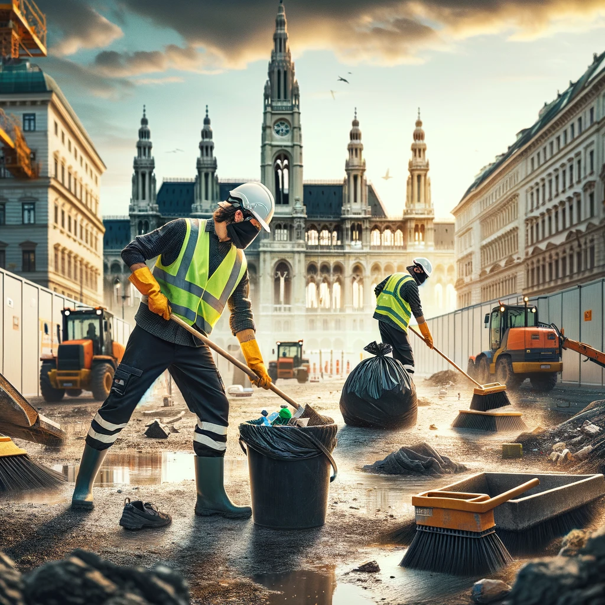

# Professionelle Baureinigung in Wien und Niederösterreich mit ENS

Willkommen bei ENS, Ihrem Experten für Baureinigung in Wien und Niederösterreich. Mit über zwei Jahrzehnten Erfahrung im Reinigungsgewerbe bieten wir umfassende Reinigungslösungen, die speziell auf die Bedürfnisse von Baustellen zugeschnitten sind. Von der Erstreinigung bis zur finalen Übergabereinigung – unser zertifiziertes Team garantiert höchste Qualität und Professionalität.

## Warum ENS für Ihre Baureinigung wählen?

### Umfangreiches Leistungsangebot

Bei ENS verstehen wir die einzigartigen Herausforderungen, die Baustellenreinigung mit sich bringt. Unsere Dienstleistungen umfassen:

- **Vorreinigung**: Bereitstellung einer sauberen Basis für weitere Bauarbeiten.
- **Zwischenreinigung**: Aufrechterhaltung der Sauberkeit während der Bauphase.
- **Endreinigung**: Sorgfältige Reinigung nach Abschluss der Bauarbeiten, um das Objekt bezugsfertig zu machen.

Zusätzlich bieten wir spezialisierte Reinigungsdienste an, um alle Aspekte der Baureinigung abzudecken, einschließlich der Entfernung von hartnäckigen Verschmutzungen und Baumaterialresten. Dies sorgt nicht nur für eine visuell ansprechende Baustelle, sondern trägt auch maßgeblich zur Sicherheit und zum Werterhalt der Immobilie bei.

### Erfahrung und Zuverlässigkeit

Unser Team besteht aus erfahrenen und geschulten Reinigungsprofis. Dank unserer ISO 9001-Zertifizierung können Sie sich auf ein Höchstmaß an Qualität und Effizienz verlassen. ENS steht für zuverlässige Reinigungsdienste, die Ihre Baustelle jederzeit in bestem Licht erscheinen lassen.

### Flexibilität und Kundenorientierung

Wir passen unsere Dienstleistungen individuell an Ihre Zeitvorgaben und spezifischen Bedürfnisse an. Unser Ziel ist es, Ihre Baustelle effizient und ohne Störung der laufenden Arbeiten zu reinigen.

### Umweltschutz und Nachhaltigkeit

ENS verpflichtet sich zum Schutz der Umwelt. Wir verwenden umweltfreundliche Reinigungsmittel und Methoden, die nicht nur gründlich reinigen, sondern auch die Umwelt schonen.

## Warum ist Baureinigung wichtig?

Eine professionelle Baureinigung ist entscheidend für den Werterhalt der Immobilie und trägt maßgeblich zur Sicherheit auf der Baustelle bei. Durch die Entfernung von Schutt und Staub wird nicht nur ein positiver erster Eindruck geschaffen, sondern auch die Grundlage für weitere Gewerke sauber und sicher gehalten.

## Fazit

Wählen Sie ENS für Ihre Baureinigung in Wien und Niederösterreich und profitieren Sie von unserem umfassenden Know-how und unserer Zuverlässigkeit. Kontaktieren Sie uns noch heute für ein unverbindliches Angebot und erfahren Sie mehr darüber, wie wir Ihre Baustelle in neuem Glanz erstrahlen lassen können.

Besuchen Sie unsere Website für weitere Informationen oder rufen Sie uns direkt an. Wir freuen uns darauf, Sie und Ihr Projekt kennenzulernen und einen Beitrag zum Erfolg Ihrer Bauvorhaben zu leisten.

_ENS – Ihr Partner für eine saubere Zukunft._
