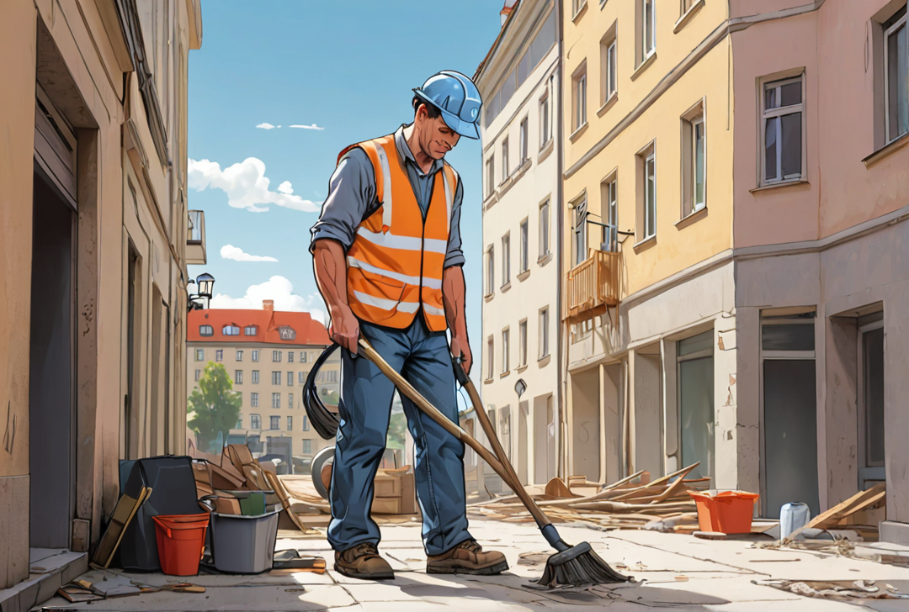

Auf Ihrer Suche nach einem zuverlässigen Partner für die Sauberkeit und Ordnung Ihrer Bauprojekte, möchten wir Ihnen unsere Dienstleistung "BAUREINIGUNG" vorstellen. Unsere Expertise erstreckt sich auf sämtliche Reinigungsarbeiten im Bauwesen, die wir maßgeschneidert für Bauträger, Bauunternehmen und Sanierungsspezialisten anbieten.

Unser Leistungsspektrum umfasst die Bauzwischenreinigung, die entscheidend ist, bevor eine neue Bauphase eingeleitet wird. Diese sorgt nicht nur für ein sauberes Arbeitsumfeld, sondern auch für die Sicherheit auf der Baustelle, indem sie potenzielle Gefahrenquellen durch herumliegenden Schutt und Abfall minimiert. Darüber hinaus sind wir spezialisiert auf die Baugrobreinigung, die grobe Verschmutzungen und Rückstände effektiv beseitigt, sowie die Bauendreinigung, mit der das Bauobjekt blitzblank für die Übergabe an Mieter oder Käufer vorbereitet wird.

Jahrelange Erfahrung in der Baureinigung hat unser Team nicht nur in die Lage versetzt, mit jeder Art von bautypischen Verschmutzungen und Verunreinigungen umzugehen, sondern auch deren Beseitigung effizient und fachgerecht zu meistern. Wir legen großen Wert darauf, Material- und Verpackungsreste sowie Bauschutt in kleinerem Umfang umweltfreundlich und sachgerecht zu entsorgen, um so unseren Beitrag zum Umweltschutz zu leisten.

Unsere Arbeit richtet sich streng nach den anerkannten Leistungsbeschreibungen im Hochbau. Dies garantiert Ihnen eine professionelle Ausführung aller Reinigungsarbeiten gemäß den höchsten Standards. Vertrauen Sie auf unsere Expertise und widmen Sie sich voll und ganz Ihrem Kerngeschäft, während wir für eine saubere und sichere Baustelle sorgen.

Lassen Sie uns gemeinsam dafür sorgen, dass Ihr Bauprojekt nicht nur erfolgreich, sondern auch sauber und ordentlich über die Bühne geht. Kontaktieren Sie uns noch heute, um mehr über unsere Dienstleistung "BAUREINIGUNG" und wie wir Ihr Projekt unterstützen können, zu erfahren. Wir freuen uns darauf, Sie und Ihr Bauprojekt mit unserer Professionalität und Erfahrung zu begleiten.
