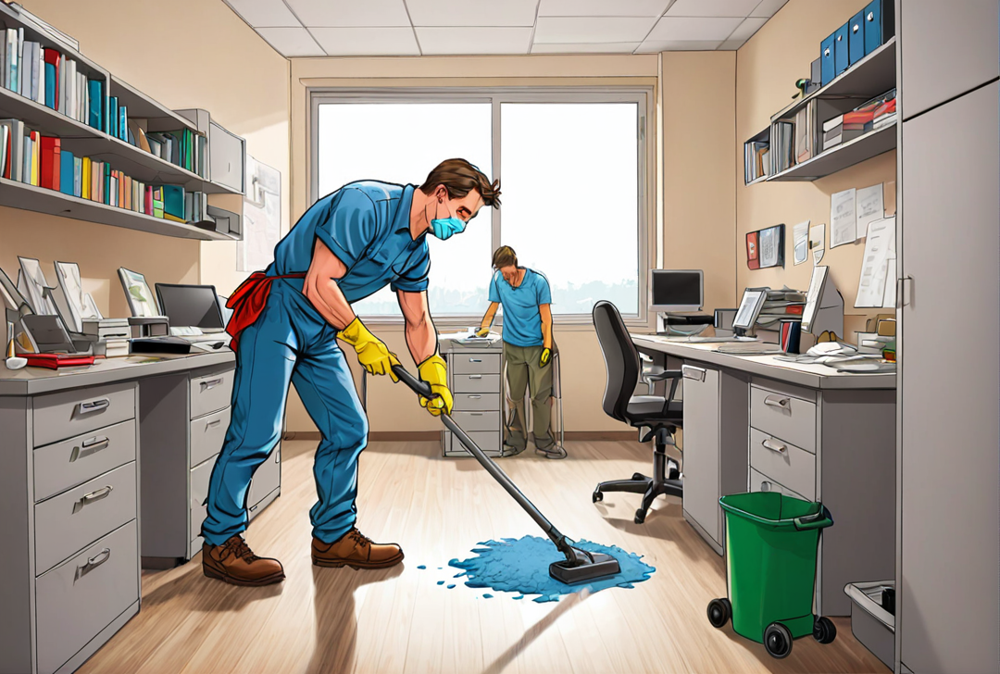

# Grundreinigung in Wien und Niederösterreich mit ENS: Ein Neuanfang für Ihre Räume

ENS bietet in Wien und Niederösterreich umfangreiche Grundreinigungsdienste an, die Ihre Räumlichkeiten nicht nur optisch auffrischen, sondern auch einen gesunden und sauberen Lebens- und Arbeitsraum schaffen. Egal, ob es sich um ein privates Zuhause, Bürogebäude oder öffentliche Einrichtung handelt, unsere erfahrenen Teams sind darauf spezialisiert, jedem Raum neues Leben einzuhauchen.

## Warum ENS für Ihre Grundreinigung?

### Umfassende Reinigungslösungen

Unsere Grundreinigung umfasst eine Tiefenreinigung aller Oberflächen, Böden, Fenster und schwer zugänglichen Bereiche. Wir entfernen hartnäckigen Schmutz, Staubansammlungen und Verunreinigungen, die sich über die Zeit angesammelt haben, und sorgen so für ein rundum erneuertes Raumgefühl.

### Einsatz modernster Technologien

Bei ENS setzen wir auf modernste Reinigungstechniken und -geräte, um effiziente und nachhaltige Reinigungsergebnisse zu erzielen. Unsere geschulten Fachkräfte verwenden umweltfreundliche Reinigungsmittel, die stark gegen Schmutz wirken, jedoch sanft zu Materialien und der Umwelt sind.

### Individuelle Reinigungspläne

Wir verstehen, dass jede Räumlichkeit ihre eigenen spezifischen Anforderungen hat. Deshalb erstellen wir maßgeschneiderte Reinigungspläne, die auf die individuellen Bedürfnisse und Zeitvorgaben unserer Kunden abgestimmt sind.

### Verbesserte Raumluftqualität

Eine gründliche Grundreinigung verbessert nicht nur das Erscheinungsbild Ihrer Räume, sondern auch die Luftqualität. Durch die Entfernung von Staub, Allergenen und Schadstoffen tragen unsere Dienste zu einem gesünderen Wohn- und Arbeitsumfeld bei.

## Die Bedeutung einer professionellen Grundreinigung

Eine regelmäßige Grundreinigung ist essentiell für die Instandhaltung und Werterhaltung Ihrer Immobilie. Sie trägt nicht nur zur Verlängerung der Lebensdauer von Bodenbelägen und Einrichtungsgegenständen bei, sondern sorgt auch für ein angenehmeres und gesünderes Umfeld für Bewohner, Mitarbeiter und Besucher.

## Fazit

Gönnen Sie Ihren Räumlichkeiten in Wien und Niederösterreich eine professionelle Grundreinigung durch ENS und erleben Sie den Unterschied. Kontaktieren Sie uns für ein maßgeschneidertes Angebot und starten Sie den Neuanfang mit blitzsauberen, erfrischten Räumen.

Besuchen Sie unsere Webseite für mehr Informationen oder nehmen Sie direkt Kontakt mit uns auf. Wir freuen uns darauf, Ihnen unsere Expertise und unseren exzellenten Service anzubieten.

_ENS – Sauberkeit, die Sie spüren können._
