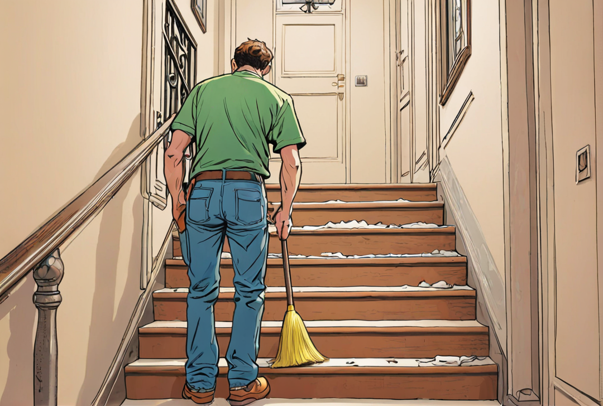

# Stiegenhausreinigung in Wien und Niederösterreich durch ENS: Ihr Weg zu einem einladenden Eingangsbereich

ENS spezialisiert sich auf die professionelle Stiegenhausreinigung in Wien und Niederösterreich. Ein sauberes und gepflegtes Stiegenhaus ist nicht nur das Aushängeschild eines jeden Gebäudes, sondern trägt auch maßgeblich zum Wohlbefinden der Bewohner und Besucher bei. Vertrauen Sie auf unsere Expertise, um Ihrem Eingangsbereich Glanz und Sauberkeit zu verleihen.

## Warum ist die Stiegenhausreinigung so wichtig?

Ein sauberes Stiegenhaus vermittelt den ersten und oft bleibenden Eindruck eines Gebäudes. Es ist der Bereich, den jeder Besucher und Bewohner sieht und nutzt. Darüber hinaus kann ein regelmäßig gereinigtes Stiegenhaus zur Sicherheit beitragen, indem es Rutschgefahren durch Schmutz und Feuchtigkeit minimiert.

## Unsere Leistungen im Überblick

### Regelmäßige Reinigung

ENS bietet regelmäßige Reinigungspläne, die auf die Bedürfnisse Ihres Gebäudes abgestimmt sind, um stets ein sauberes und einladendes Ambiente zu gewährleisten.

### Umfassende Reinigungsmethoden

Von der Bodenreinigung über die Säuberung von Handläufen bis hin zur Entfernung von Spinnweben und Staub an schwer zugänglichen Stellen – wir sorgen für eine gründliche Reinigung Ihres Stiegenhauses.

### Flexibilität und Zuverlässigkeit

Wir passen uns Ihren Zeitvorgaben an und stellen sicher, dass unsere Reinigungsdienste stets pünktlich und zuverlässig durchgeführt werden.

### Umweltfreundliche Reinigungsprodukte

ENS legt Wert auf den Einsatz von umweltfreundlichen und schonenden Reinigungsprodukten, die effektiv reinigen, ohne die Umwelt zu belasten.

## Der ENS Unterschied

Mit ENS wählen Sie einen Partner, der die Bedeutung eines sauberen Stiegenhauses versteht und sich dementsprechend mit größter Sorgfalt und Professionalität Ihrer Immobilie annimmt. Unsere geschulten Mitarbeiter nutzen ihre Erfahrung und Fachkenntnisse, um beste Reinigungsergebnisse zu erzielen.

## Fazit

Geben Sie Ihrem Stiegenhaus in Wien und Niederösterreich die Aufmerksamkeit, die es verdient, mit den professionellen Stiegenhausreinigungsdiensten von ENS. Kontaktieren Sie uns, um mehr über unsere Dienstleistungen zu erfahren oder einen Reinigungstermin zu vereinbaren.

Besuchen Sie unsere Webseite oder rufen Sie uns direkt an. Wir freuen uns darauf, Sie mit unserer Qualität und unserem Service zu überzeugen.

_ENS – Sauberkeit, die den Unterschied macht._
