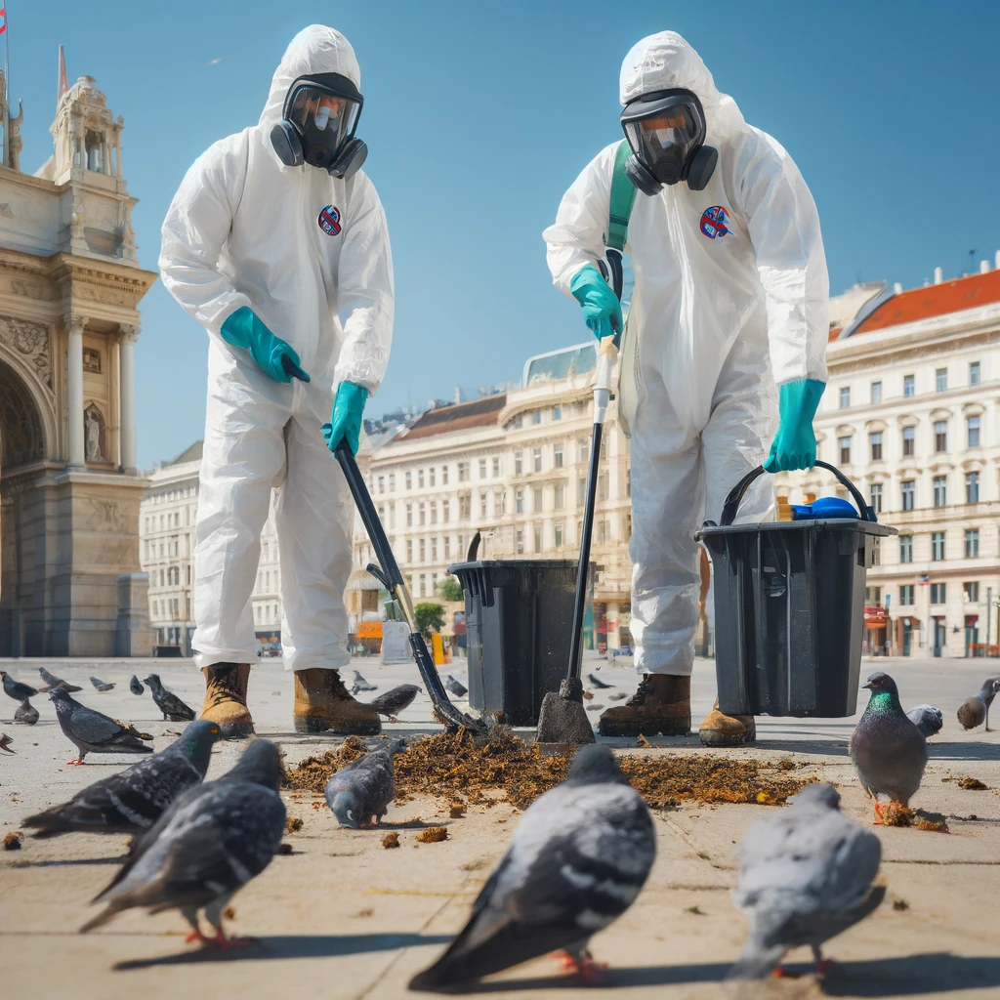

# Professionelle Taubenkotentfernung in Wien und Niederösterreich durch ENS

ENS bietet in Wien und Niederösterreich spezialisierte Dienste zur Taubenkotentfernung an, um Ihre Immobilie vor den schädlichen und unansehnlichen Auswirkungen von Vogelkot zu schützen. Taubenkot kann nicht nur das äußere Erscheinungsbild eines Gebäudes beeinträchtigen, sondern auch langfristige Schäden verursachen und gesundheitliche Risiken darstellen. Verlassen Sie sich auf unsere Expertise, um Ihr Gebäude sicher und gründlich zu reinigen.

## Warum ist die Entfernung von Taubenkot wichtig?

Taubenkot ist hochgradig säurehaltig und kann Baumaterialien wie Stein, Metall und Holz erheblich beschädigen. Zudem bergen die Exkremente Gesundheitsrisiken, da sie Krankheitserreger enthalten können. Eine professionelle Reinigung hilft, diese Risiken zu minimieren und trägt zur Werterhaltung Ihrer Immobilie bei.

## Unsere Dienstleistungen

### Gründliche Reinigung

Unsere speziell ausgebildeten Teams entfernen Taubenkot unter Einsatz von Schutzausrüstung und umweltfreundlichen Reinigungsmitteln, um Oberflächen sicher und effektiv zu säubern.

### Desinfektion

Nach der Entfernung des Taubenkots desinfizieren wir die betroffenen Bereiche gründlich, um gesundheitliche Risiken durch verbleibende Bakterien und Viren zu eliminieren.

### Präventive Maßnahmen

Neben der Reinigung beraten wir Sie gerne zu präventiven Maßnahmen, um eine erneute Verschmutzung durch Tauben zu verhindern, beispielsweise durch die Installation von Vogelabwehrsystemen.

### Flexibilität und Diskretion

Wir verstehen die Sensibilität dieser Aufgabe und garantieren eine diskrete Durchführung unserer Dienstleistungen zu einem für Sie passenden Zeitpunkt.

## Der ENS Unterschied

Bei ENS setzen wir auf Fachwissen, Erfahrung und den Einsatz modernster Reinigungstechnologien, um die bestmöglichen Ergebnisse zu erzielen. Unsere Teams sind geschult in der sicheren Entfernung von Taubenkot und der Anwendung von Desinfektionsverfahren, um Ihre Gesundheit und Sicherheit zu gewährleisten.

## Fazit

Schützen Sie Ihre Immobilie in Wien und Niederösterreich vor den negativen Auswirkungen von Taubenkot mit den professionellen Reinigungsdiensten von ENS. Kontaktieren Sie uns für eine Beratung oder um einen Termin für die Taubenkotentfernung zu vereinbaren.

Besuchen Sie unsere Webseite oder rufen Sie uns direkt an. Wir sind hier, um Ihnen zu helfen, Ihr Gebäude sauber, sicher und einladend zu halten.

_ENS – Ihr Partner für eine saubere und sichere Umgebung._
